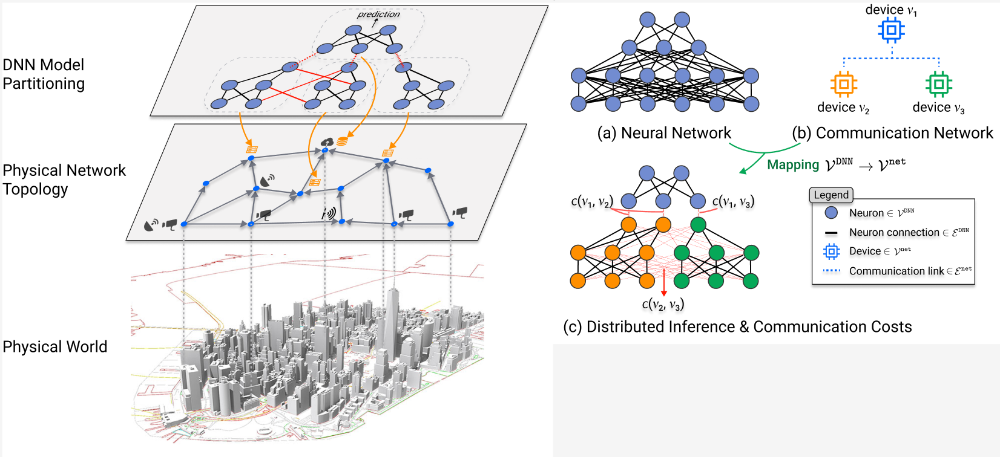

# Official Implementation of CaP @ INFOCOM 23

This codebase contains the implementation of **[Communication-Aware DNN Pruning] (INFOCOM2023)**.

## Introduction
We propose a Communication-aware Pruning (CaP) algorithm, a novel distributed inference framework for distributing DNN computations across a physical network. 
Departing from conventional pruning methods, CaP takes the physical network topology into consideration and produces DNNs that are communication-aware, designed for both accurate and fast execution over such a distributed deployment. 
Our experiments on CIFAR-10 and CIFAR-100, two deep learning benchmark datasets, show that CaP beats state of the art competitors by up to 4% w.r.t. accuracy on benchmarks. 
On experiments over real-world scenarios, it simultaneously reduces total execution time by 27%--68% at negligible performance decrease (less than 1%).
<p align="center">

</p>


## Environment Setup
Please install the python dependencies and packages found below:
```bash
pytorch-1.6.0
numpy-1.16.1
scipy-1.3.1
tqdm-4.33.0
yaml-0.1.7
```    


## Instructions
We provide a sample bash script to run our method at 0.75 sparsity ratio on CIFAR-10.


To run CaP:

```bash
source env.sh
run-cifar10-resnet18.sh
```

## Cite
```
@article{jian2023cap,
  title={Communication-Aware DNN Pruning},
  author={Jian, Tong and Roy, Debashri Roy and Salehi, Batool and Soltani, Nasim and Chowdhury, Kaushik and Ioannidis, Stratis}
  journal={INFOCOM},
  year={2023}
}
```
